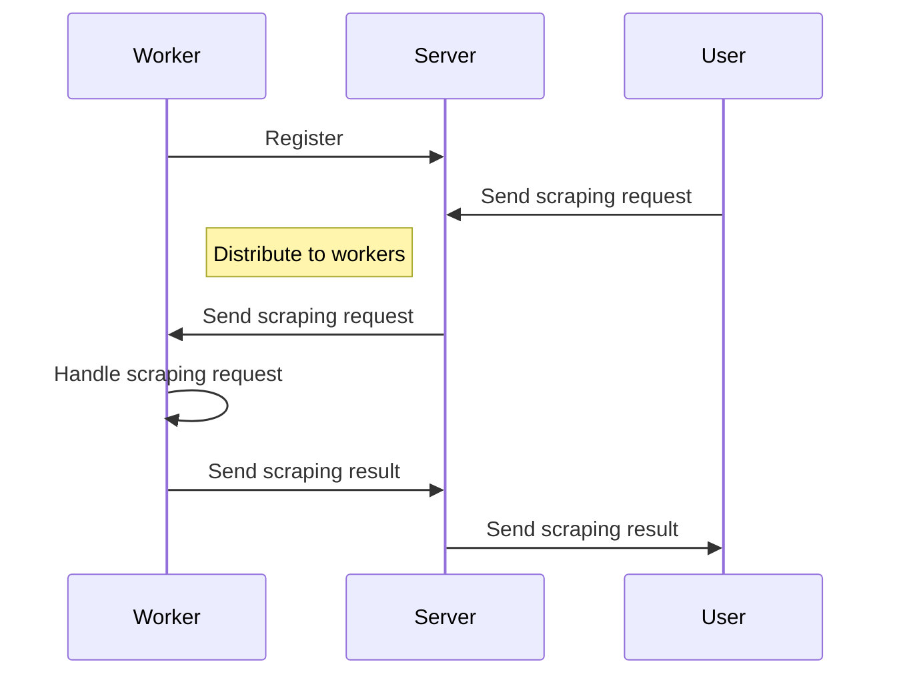

# chrome-scraper-server
Chrome scraper is a web crawler that help you act as a real browser

## Concept

The idea is to use a real browser to scrape the web. This is useful when you need to scrape a website that uses JavaScript to render the content.

It is composed of two parts:

- A server that act as a load balancer, exposing a REST API to receive the scraping requests and distribute them to the workers.
- A client, that's a chrome extension, that will be installed in the workers. This extension will be responsible for opening the browser, navigating to the page and scraping the content.

## How it works

The server will receive a scraping request and will distribute it to the workers. The workers will open a new tab in the browser, navigate to the page and scrape the content. The content will be sent back to the server and then to the client.

